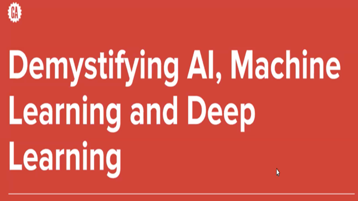
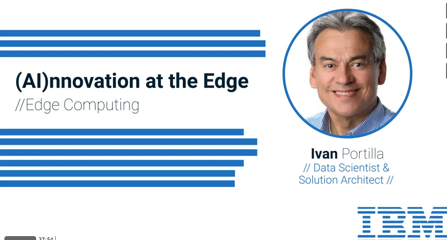

# About Me

Thank you for taking interest in my work.

I am an author and keynote speaker, I am recognized for my innovative work in data science, robotics and artificial intelligence. I am also a member of the IBM Academy of Technology. 

You can connect with me here: [LinkedIn](https://www.linkedin.com/in/ivanportilla/)
##  Publications
* [Chatbots in AIOops](https://community.ibm.com/community/user/aiops/blogs/ivan-portilla/2021/06/14/chatbots-in-aiops)
* Highlighted in the [Longmont Leader newspaper](https://www.longmontleader.com/local-news/svvsd-students-developing-ibm-powered-technology-bring-real-life-solutions-to-life-3746811) for my work with [P-TECH](https://www.ptech.org/)
* Featured in the [IBM 2020 Diversity & Inclusion Report](https://www.ibm.com/impact/be-equal/pdf/IBM_Diversity_Inclusion_Report_2020.pdf)
* [IBM Academy Publication: The Artificial Intelligence Model Lifecycle Management White Paper](https://www.ibm.com/blogs/academy-of-technology/ai-model-lifecycle-management-white-paper/)
* [AI Model Lifecycle Management: Organize Phase](https://www.ibm.com/cloud/blog/ai-model-lifecycle-management-organize)
* [5G at the Edge](https://www.ibm.com/cloud/blog/5g-at-the-edge)
* [Analytics at the Edge](https://www.ibm.com/cloud/blog/analytics-at-the-edge)
* [Models Deployed at the Edge](https://www.ibm.com/cloud/blog/models-deployed-at-the-edge)
* [Three things you can do to keep your IT skills current at work](https://www.ibm.com/blogs/watson/2016/07/three-things-can-keep-skills-current-work/)

##  Podcasts
* [Leadership in the Age of Artificial Intelligence](https://crestcom.com/blog/2020/09/18/episode-39-leadership-in-the-age-of-ai-with-it-architect-and-data-scientist-ivan-portilla/)

##  Talks
<dl>
  <dt>Videos</dt>
  
  

   <dd>Jeff Jonas Interview</dd>

  <dd>IBM Colorado Technical Vitality Council May 2021</dd>

  

  <dd>IBM Think 2021</dd>

  
  <dd>Guest Speaker at General Assembly</dd>
  
  
 <dd>Guest Speaker at Columbia University</dd>
  
  

  <dd>Guest Speaker at London School of Economics</dd>
  
  

  <dd>Demystifying AI, Machine Learning and Deep Learning</dd>
  
  

  <dd>Edge Computing - AI at the Edge</dd>

  <dd>IBM Edge Computing demo.</dd>
  <dd>Leadership in the Age of AI</dd>

  <dd>IBM Edge Computing demo.</dd>

  

  <dd>Exploring the Human + Artificial Intelligence Partnership.</dd>

   <dd>WayBlazer Cognitive Conversion Application Powered by Watson & Neo4j.</dd>

</dl>
