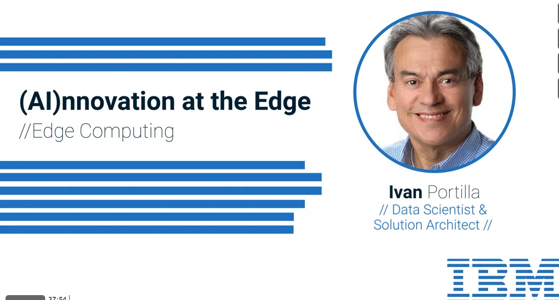

# About Me

Thank you for taking interest in my work.

I am an author and keynote speaker, I am recognized for my innovative work in data science, robotics and artificial intelligence. I am also a member of the IBM Academy of Technology. 

You can connect with me here: [LinkedIn](https://www.linkedin.com/in/ivanportilla/)
##  Publications
* [Analytics at the Edge](https://www.ibm.com/cloud/blog/analytics-at-the-edge)
* [Models Deployed at the Edge](https://www.wittkieffer.com/position/36612-chair-in-embodied-intelligence/)
* [Three things you can do to keep your IT skills current at work](https://www.ibm.com/blogs/watson/2016/07/three-things-can-keep-skills-current-work/)

##  Podcasts
* [Leadership in the Age of Artificial Intelligence](https://crestcom.com/blog/2020/09/18/episode-39-leadership-in-the-age-of-ai-with-it-architect-and-data-scientist-ivan-portilla/)

##  Talks

<dl>
  <dt>Videos</dt>
 
  <dd>Edge Computing - AI at the Edge</dd>
</dd>
  <dd>IBM Edge Computing demo.</dd>
  <dd>Leadership in the Age of AI</dd>

  <dd>IBM Edge Computing demo.</dd>

  
  <dd>Exploring the Human + Artificial Intelligence Partnership.</dd>

   <dd>WayBlazer Cognitive Conversion Application Powered by Watson & Neo4j.</dd>

</dl>
